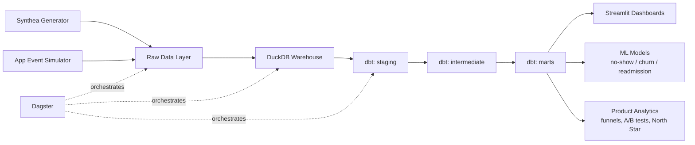

# Architecture & Build Plan

## Data Sources

- **Synthea** — open source synthetic patient generator producing realistic EHR data (patients, encounters, conditions, medications, observations). No PHI/privacy concerns, fully reproducible.
- **Simulated app-event layer** — custom Python generator on top of Synthea patients: onboarding funnel, app logins, push notification sends/opens, appointment bookings/no-shows, medication adherence logs. Built with realistic variance (disengagement over time, adherence correlated with condition severity, etc.).

## Architecture Diagram

## Phased Build Plan

**Phase 0 — Setup**
Repo scaffold, environment (Python venv/poetry), README skeleton, license.

**Phase 1 — Data Foundation (DE)**
Generate 2,000–5,000 Synthea patients focused on chronic conditions (diabetes, hypertension, COPD). Build the app-event simulator: onboarding funnel, login frequency decay, adherence logging tied to condition severity, appointment scheduling/no-show rates.

**Phase 2 — Ingestion & Modeling (DE)**
Load raw CSVs into DuckDB. Build dbt staging models (cleaned, typed, deduplicated) and data quality tests (uniqueness, not-null, referential integrity, accepted ranges).

**Phase 3 — Marts & Orchestration (DE)**
Build dbt marts: `dim_patients`, `fct_encounters`, `fct_appointments`, `fct_app_events`, `fct_medication_adherence`. Wire up a Dagster pipeline (assets + schedule) that runs generation → ingestion → dbt build end-to-end.

**Phase 4 — Dashboards (DA)**
Streamlit dashboard: engagement overview (DAU/WAU/MAU), retention cohort curves, medication adherence trends by condition, appointment no-show rates by demographic/segment.

**Phase 5 — ML Models (DS)**
- No-show prediction model (classification)
- Patient disengagement/churn risk model
- 30-day readmission risk model

Each with feature engineering from marts, evaluation metrics, and feature importance/explainability (SHAP).

**Phase 6 — Product Analytics**
- Onboarding funnel analysis (signup → first login → first appointment → ongoing engagement)
- Simulated A/B test (e.g., medication reminder nudge vs. control) with power analysis, significance testing, and a written experiment readout
- North Star metric definition (e.g., % of patients adherent at 90 days) tracked over time

**Phase 7 — Polish**
CI (GitHub Actions running dbt tests + pytest), screenshots/GIFs of dashboards, deploy Streamlit app publicly, write-up of design decisions and tradeoffs.

## Skills Demonstrated (by role)

- **Data Engineering:** pipeline design, orchestration, dbt modeling, data quality testing, CI/CD
- **Data Science:** predictive modeling, feature engineering, model evaluation, explainability
- **Data Analytics:** dashboarding, cohort/retention analysis, SQL-based metric definitions
- **Product Analytics:** funnel analysis, experimentation/A-B testing, North Star metric framework, health-tech domain metrics (adherence, no-show rate, readmission)
